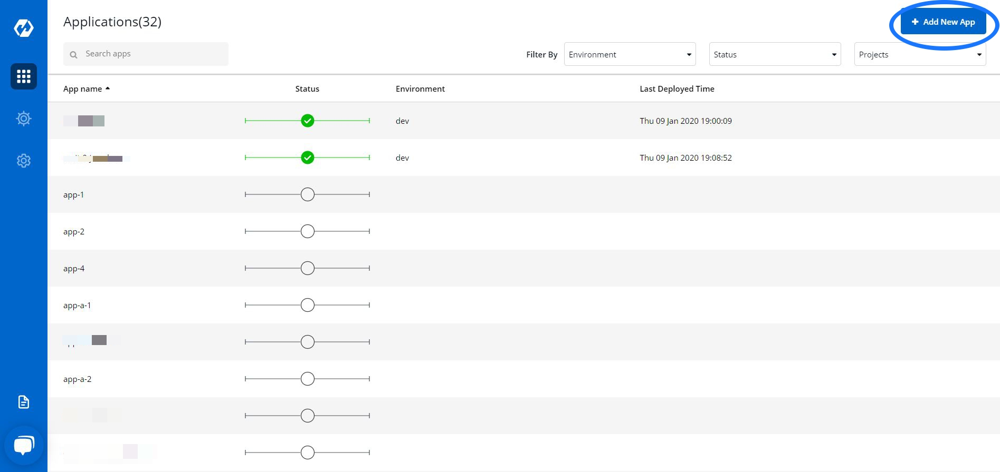
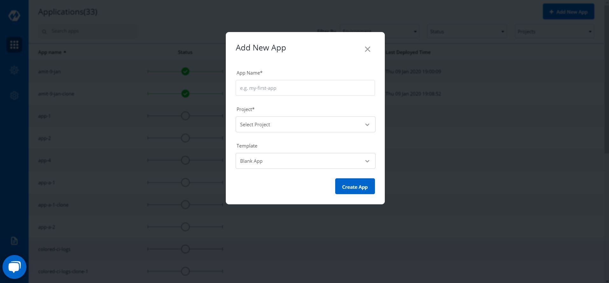
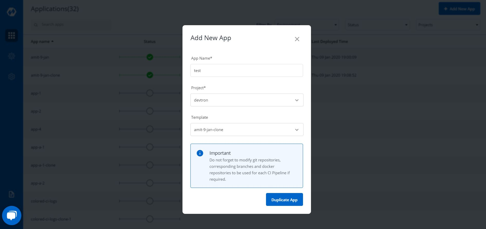
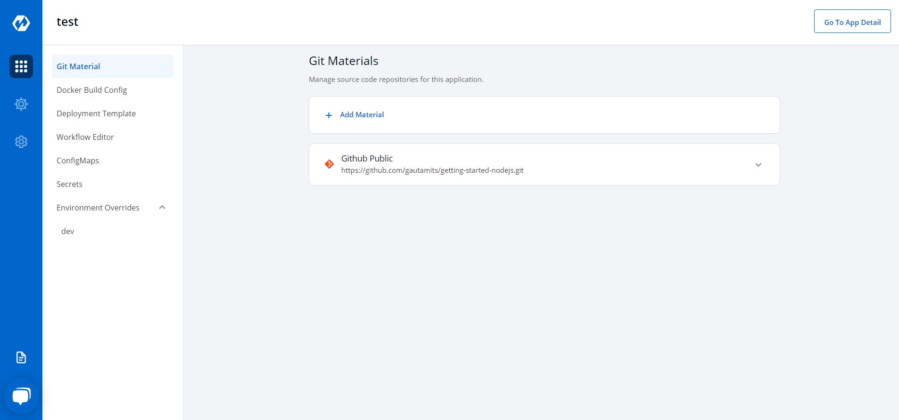

# Cloning Apps

 

Select Add New App to add a new app

Key | Description
---- | -----
`App Name` | Name of the new app
`Project` | Project name
`Template` | App from which the template has to be copied

 

Select Create App to create App

__
New app with duplicate template is created

