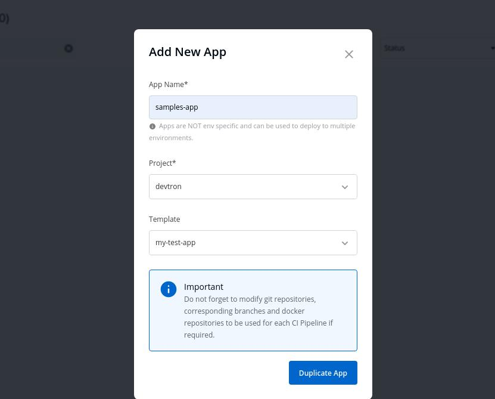

# Cloning Apps

 

Select `Add New App` to Create a new app.

 

 

Key | Description
---- | -----
`App Name` | Name of the new app
`Project` | Project name
`Template` | App from which the template has to be copied

 

Click on `Duplicate App` to create App with a template of the Application you have selected from the Drop-down.

 

New application with a duplicate template is created.

