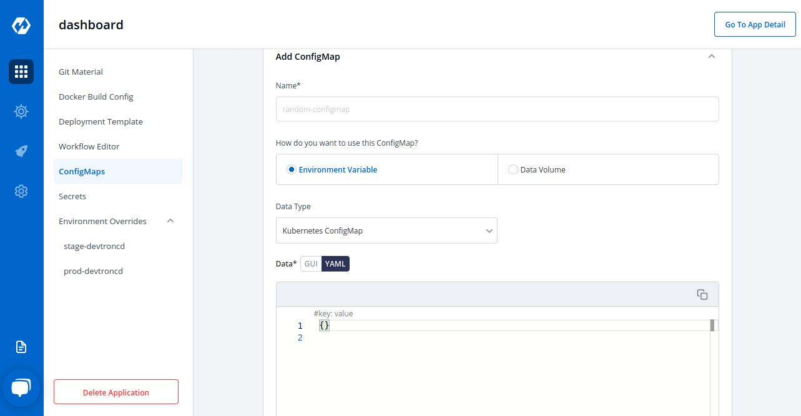
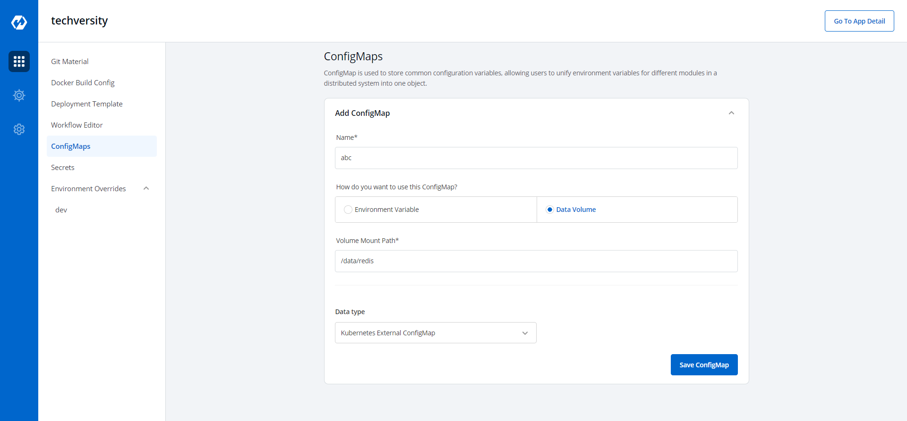
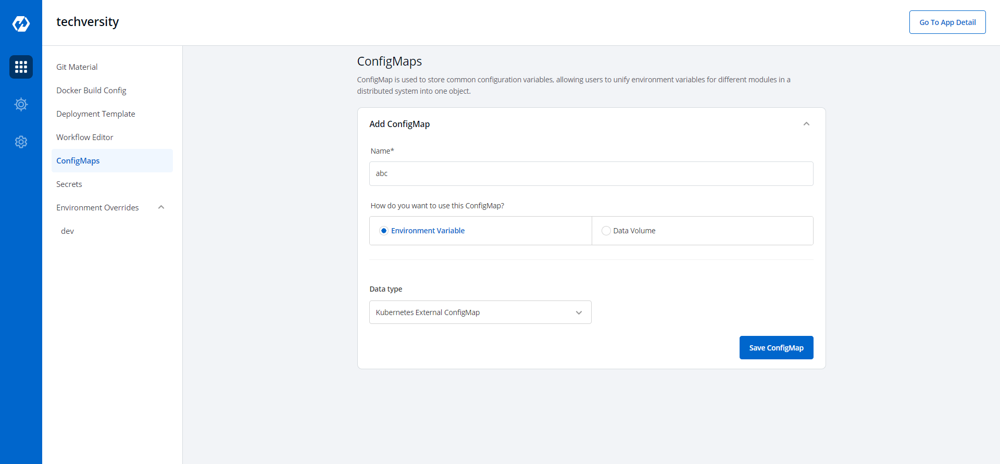
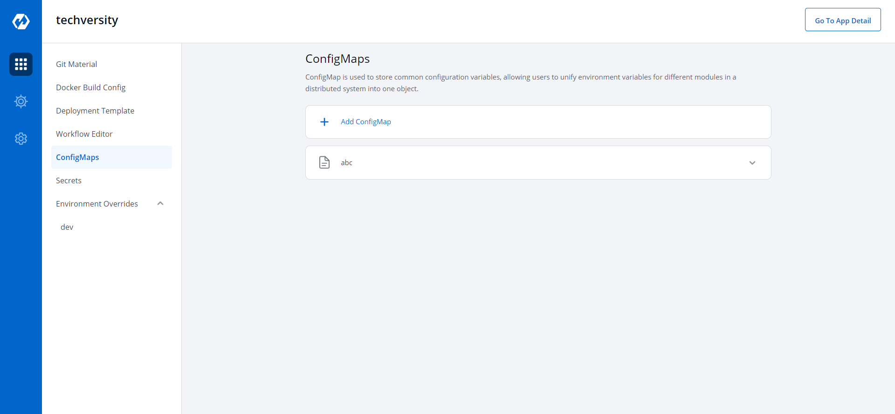

## Config Maps
The ConfigMap API resource holds key-value pairs of configuration data that can be consumed in pods or used to store configuration data for system components such as controllers. ConfigMap is similar to Secrets, but designed to more conveniently support working with strings that do not contain sensitive information.

Click on ConfigMaps to config a map

Key  | Description
-----|-----
`Name` | Name of the configmap
`Environment Variable` | Select if there are Environment Variables to be injected in pods
`Data Volume` | Select if a directory accessible to all containers running in a pod needs to be added
`Kubernetes ConfigMap` | ConfigMap created by Devtron
`Key` | Key 
`Value` | Value for a given key

Click on "Yaml" to view "key" and "Value" in Yaml format

### Volume Mount Path
Enter the path of the volume mount

### Kubernetes External ConfigMap
You will have to ensure that the config map is available to the pod.

Click Save ConfigMap to save the config Map

The config map is created

