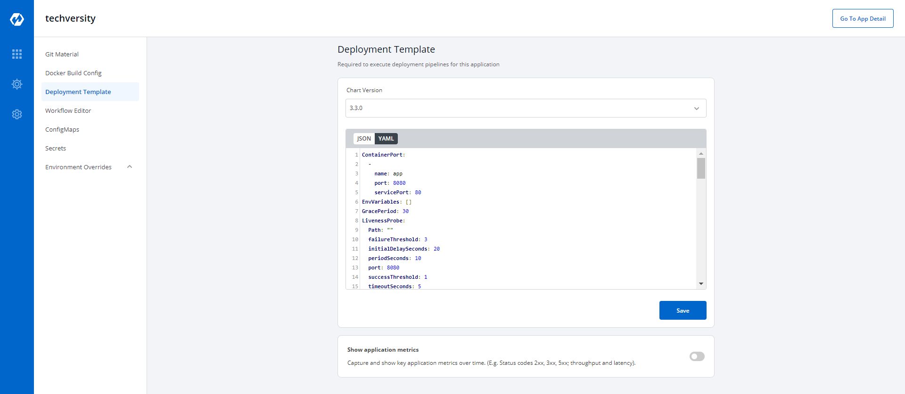

# Deployment Configurations



## Container

This defines ports on which application services will be exposed to other services
```html
ContainerPort:
    name: app
    port: 8080
    servicePort: 80
```

Key |Description
----|----
`name` | name of the container
`port` | port for the container
`servicePort` | service port for the container


## Liveness Probe

If this check fails, kubernetes restarts the pod. This should return error code in case of non-recoverable error
```html
LivenessProbe:
  Path: ""
  port: 8080
  initialDelaySeconds: 20
  periodSeconds: 10
  successThreshold: 1
  timeoutSeconds: 5
  failureThreshold: 3
```


Key | Description
-----|-----
`Path`  |It define the path where the liveness needs to be checked.
`failureThreshold` |It defines the maximum number of failures that are acceptable before a given container is not considered as live.
`initialDelaySeconds` |It defines the time to wait before a given container is checked for liveliness.
`periodSeconds` |It defines the time to check a given container for liveness.
`successThreshold` |It defines the number of successes required before a given container is said to fulfil the liveness probe.
`timeoutSeconds` |It defines the time for checking timeout.


## Readiness Probe

If this check fails, kubernetes stops sending traffic to the application. This should return error code in case of errors which can be recovered from if traffic is stopped
```html
ReadinessProbe:
  Path: ""
  port: 8080
  initialDelaySeconds: 20
  periodSeconds: 10
  successThreshold: 1
  timeoutSeconds: 5
  failureThreshold: 3
```


Key  |Description
---|---
`Path`                |It define the path where the rediness needs to be checked.
`failureThreshold`    |It defines the maximum number of failures that are acceptable before a given container is not considered as ready.
`initialDelaySeconds` |It defines the time to wait before a given container is checked for readiness.
`periodSeconds`       |It defines the time to check a given container for readiness.
`successThreshold`    |It defines the number of successes required before a given container is said to fulfil the rediness probe.
`timeoutSeconds`      |It defines the time for checking timeout.
## Autoscaling 

This is connected to HPA and controls scaling up and down in response to request load
```html
autoscaling:
  enabled: false
  MinReplicas: 1
  MaxReplicas: 2
  TargetCPUUtilizationPercentage: 90
  TargetMemoryUtilizationPercentage: 80
```


Key   |Description
-------|--------
`MaxReplicas`                   |Maximum number of replicas allowed for scaling.
`MinReplicas`                   |Minimum number of replicas allowed for scaling.
`TargetCPUUtilizationPercentage`        |The target CPU utilization that is expected for a container.
`TargetMemoryUtilizationPercentage`  |The target memory utilization that is expected for a container.
`enabled`                   |to enable autoscaling or don't enable it.


## Image


```html
image:
  pullPolicy: IfNotPresent
 
```
Image is used to access images in kubernetes, pullpolicy is used to define the instances calling the image, here the image is pulled when the image is not present,it can also be set as "Always". 

## Ingress

This allows public access to the url, please ensure you are using right nginx annotation for nginx class, its default value is nginx
```html
ingress:
  enabled: false
  annotations: {}
  path: ""
  host: ""
  tls: []
```


Key |Description
----|----
`enabled` | Enable or disable ingress
`annotations`|  To configure some options depending on the Ingress controller
`path`| Path name
`host` | Host name
`tls` | It contains security details


 
## Ingress Internal
 
 This allows private access to the url, please ensure you are using right nginx annotation for nginx class, its default value is nginx
```html
ingressInternal:
  enabled: false
  annotations: {}
  path: ""
  host: ""
  tls: []
```


Key |Description
----|----
`enabled` | Enable or disable ingress
`annotations`|  To configure some options depending on the Ingress controller
`path`| Path name
`host` | Host name
`tls` | It contains security details


 
## Resources

These define minimum and maximum RAM and CPU available to the application
```html
resources:
  limits:
    cpu: '1'
    memory: 200Mi
  requests:
    cpu: '0.10'
    memory: 100Mi
```

Resources are required to set CPU and memory usage.
### Limits


Limits make sure a container never goes above a certain value. The container is only allowed to go up to the limit, and then it is restricted.<br />

### Requests
 
 Requests are what the container is guaranteed to get.


## Service

This defines annotations and the type of service, optionally can define name also
```html
  service:
    type: ClusterIP
    annotations: {}
```


## Volumes


```html
 volumes: []
```

It is required when some values need to be read from or written to an external disk.


## Volume Mounts

```html
volumeMounts: []
```

It is used to provide mounts to the volume


## Affinity 

```html
Spec:
  Affinity:
    Key:
    Values:
```

Spec is used to define the desire state of the given container.
Inter-pod affinity allow you to constrain which nodes your pod is eligible to be scheduled based on labels on pods.

### Key
Key part of the label for node selection, this should be same as that on node. Please confirm with devops team

### Values
Value part of the label for node selection, this should be same as that on node. Please confirm with devops team


## Tolerations

```html
tolerations:
  key: "key"
  operator: "Equal"
  value: "value"
  effect: "NoSchedule"
```

A given pod can access the given node and avoid the given taint only if the given pod satisfies a given taint.


## Arguments

```html
args:
  enabled: false
  value: []
```

This is used to give arguments to command 


## Command

```html
command:
  enabled: false
  value: []
```

It contains the commands for the server.

Key     | Description
-------|--------
`enabled`  |To enable or disable the command.
`value` |It contains the commands.


## Prometheus

``` html
  prometheus:
    release: monitoring
```

It is a kubernetes monitoring tool and the name of the file to be monitored as monitoring in the given case.It describes the state of the prometheus.


## Grace Period

```html
GracePeriod: 30
```
If it has expired then the task is requeued to be executed again.


## Min Ready Seconds

```html
MinReadySeconds: 60
```

Minimum number of seconds for which a newly created pod should be ready without any of its container crashing, for it to be considered available

## Server

```html
server:
  deployment:
    image_tag: 1-95a53
    image: ""
```

It is used for providing server configurations.


### Deployment

It gives the details for deployment

Key     | Description
-------|--------
`image_tag` |It is the image tag
`image`      |It is the URL of the image


## Service Monitor

```html
servicemonitor:
  enabled: false
```

It gives the set of targets to be monitored.

## Db Migration Config

```html
dbMigrationConfig:
  enabled: false
```

It is used to configure database migration

## Application Metrics

Application metrics can be enabled to see your application's metrics-CPU usage,Memory Usage,Status,Throughput and Latency.

## Deployment Metrics 

A deployment strategy is a way to make changes to an application, without downtime in a way that the user barely notices the changes. There are different types of deployment strategies. Click on: [Types of Deployment Strategies](https://docs.devtron.ai/docs/deployment-strategies/)


