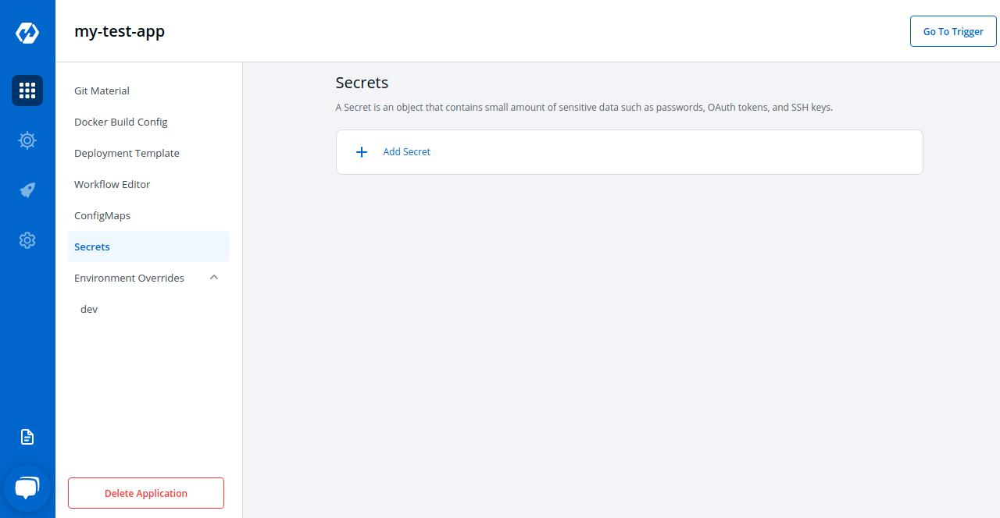
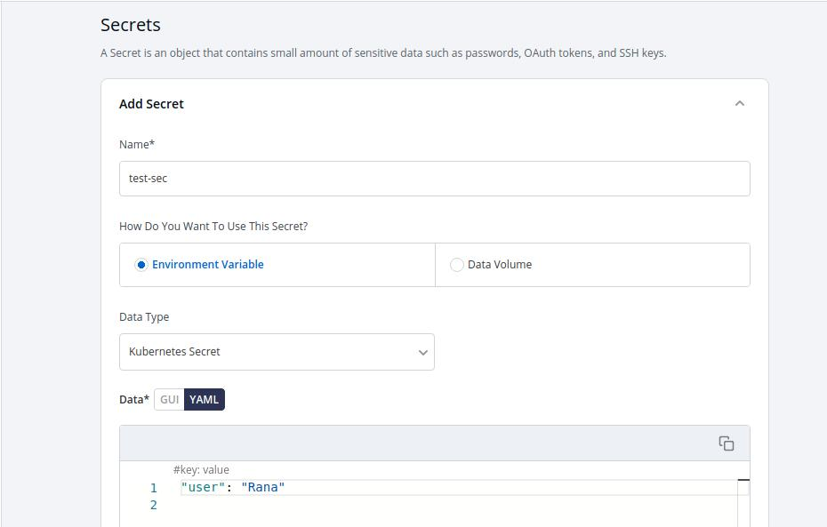
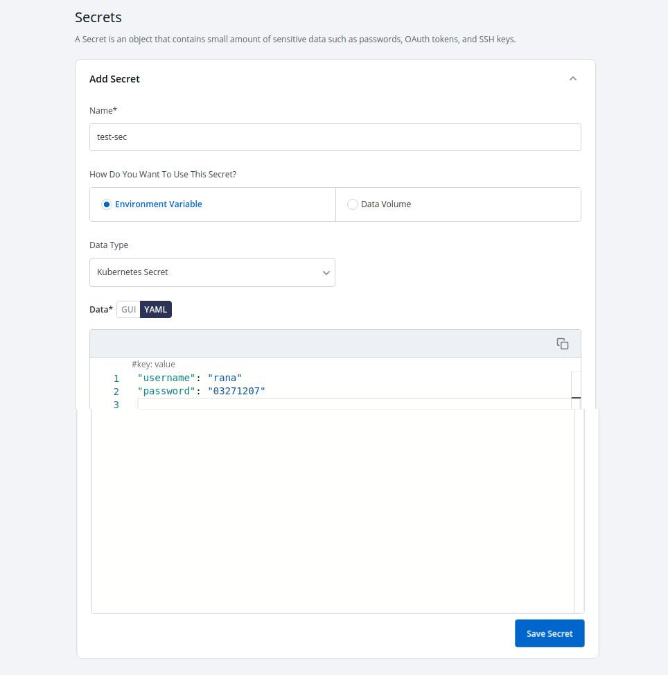
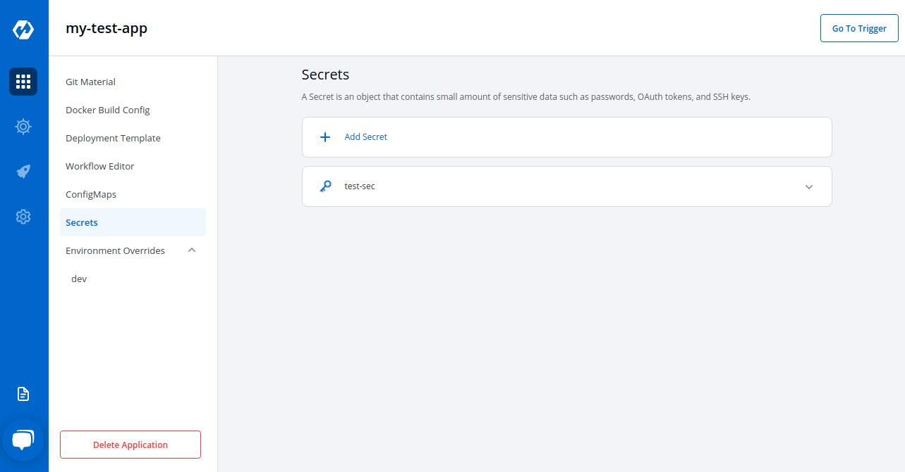

## Secrets 

Secret objects lets you store and manage sensitive information, such as passwords, Auth tokens, and ssh keys. Embedding this information in a secret is safer and more flexible than putting it verbatim in a Pod definition or in a container image.

 

 

Click on `Add Secret` to add a new secret.

 

### Configure Secret

 

Key | Description
----|----
`Name` | Name of the Secret
`Data Type` | Data Type of the Secret, To know about different Data Types available Click on: [Data Types]()
`Data Volume` | Specify, if there is a volume that is accessible to Containers running in a pod needs to be added
`Environment Variable` | Select if there are Environment Variables to be injected in pods
`Key` | Key
`Value` | Value for a given key

 

### Data Types

There are namely five Data types, that you can use to save your secret.

* *Kubernetes Secret* :
* *Kubernetes External Secret* :
* *AWS Secret Manager* :
* *AWS System Manager* :
* *Harshi Corp Vault* :

### Volume Mount Path

Specify Volume Mount folder path in `Volume Mount Path`, path where the data volume needs to be mounted, which will be accessible to the Containers running in a pod.

 

 
s
Click on Save Secret to save the secret.

 

 

You can see the Secret is added.

