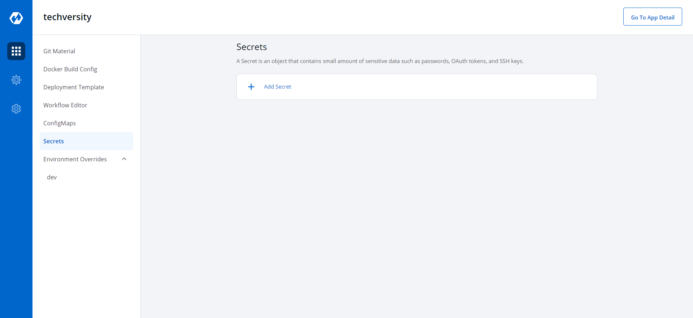
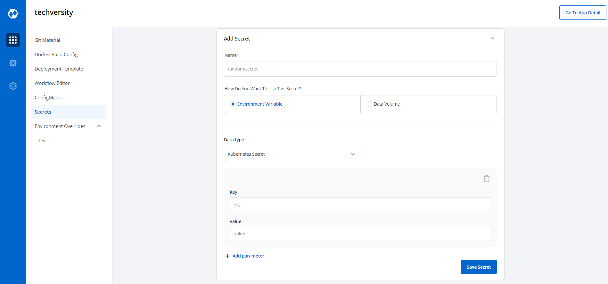
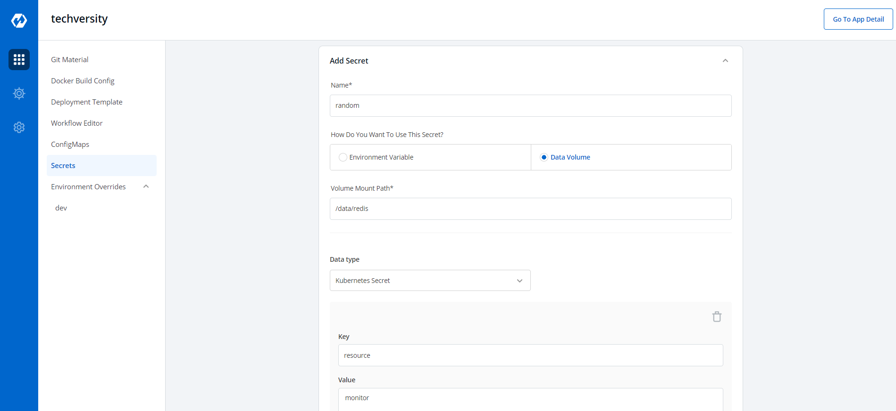
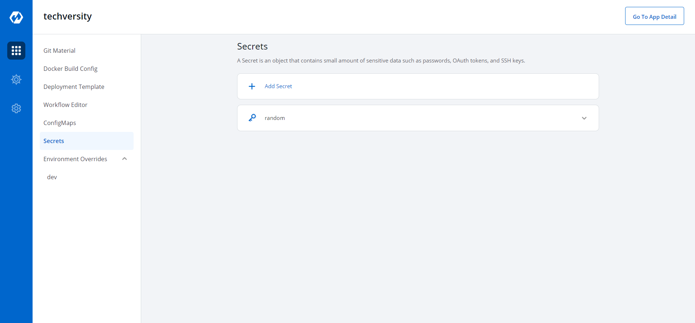

## Secrets 
Secret objects lets you store and manage sensitive information, such as passwords, Auth tokens, and ssh keys. Putting this information in a secret is safer and more flexible than putting it verbatim in a Pod definition or in a container image.

Click on Add Secret to add a new secret.

Key | Description
---- | ----
`Name` | Name of the secret to be added
`Data Type` | Data type of the secret to be added
`Data Volume` | Select if a directory accessible to all containers running in a pod needs to be added
`Environment Variable` | Select if there are Environment Variables to be injected in pods
`Key` | Key
`Value` | Value for a given key

### Volume Mount Path
Enter the path of the volume mount.

Click on Save Secret to save the secret.

You can see the Secret is added.

