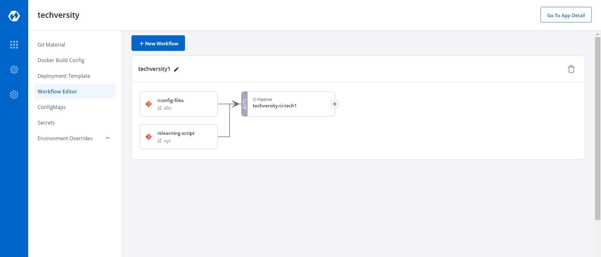
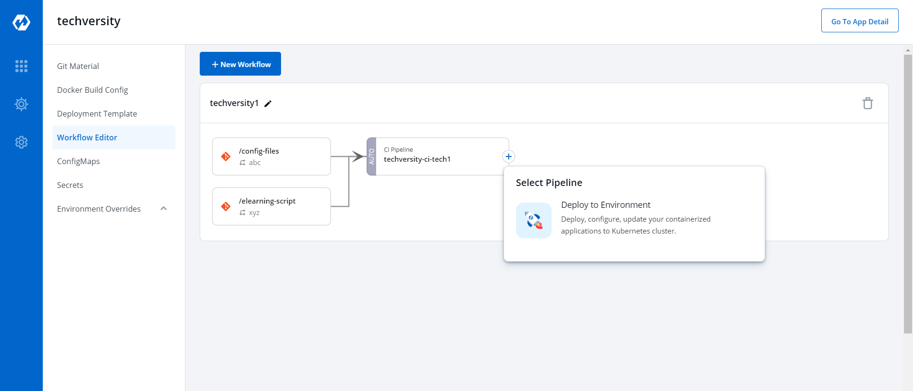
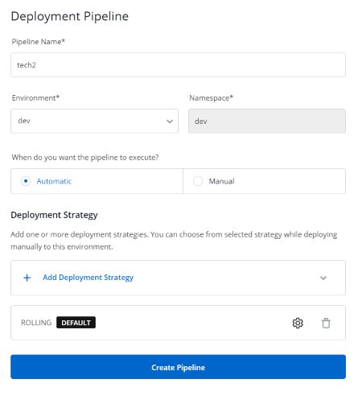
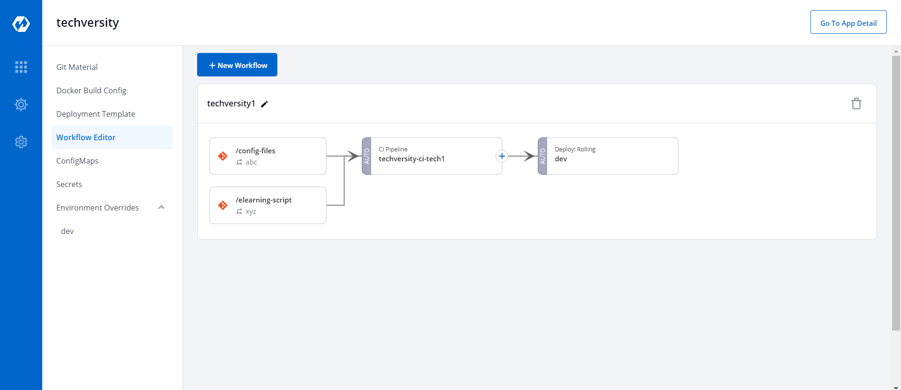
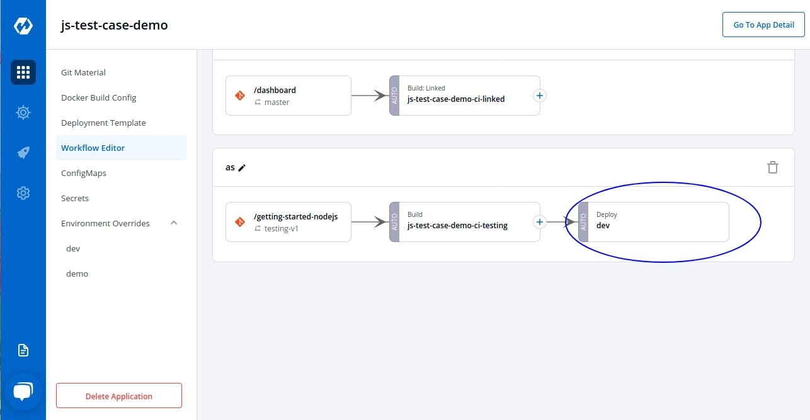
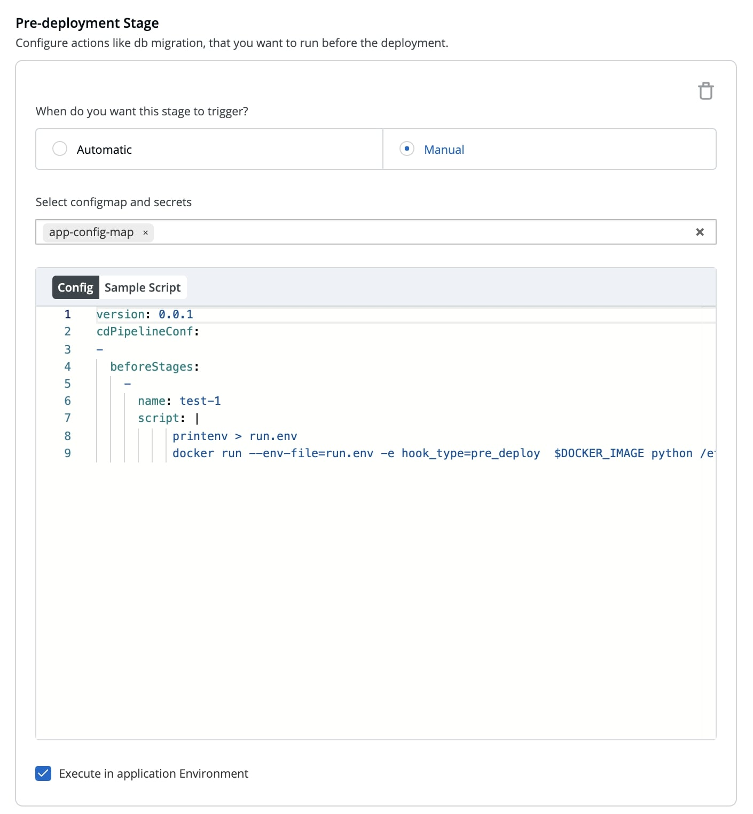

# CD Pipelines

## Create CD Pipeline

<br />



Click on "+" on CI Pipeline to attach a CD Pipeline

<br />


Select Deploy to Environment to create CD Pipeline


<br />



<br />


<br>

Key | Description
----|----
`Pipeline Name` | Enter the name of the pipeline to be created
`Environment` | Select the environment
`Deployment Strategy` | Select the type of deployment strategy that  you want to enable by clicking "Add Deployment Strategy"


Click on `Create Pipeline` to create the CD Pipeline
<br>



<br>

The CD Pipeline is created


## Update CD Pipeline 

You can update the CD Pipeline, updatations such as adding Deployment Stage, Deployment Strategy but you cannot update the name of CD Pipeline or it's Deploy Environment, if you require to change such configurations you need to make another CD Pipeline 

<br>

 To Update a CD Pipeline, go to the App Configurations and then click on Workflow editor
 
 <br>



<br>

Click on your CD Pipeline to Update/Delete the  CD Pipeline

<br>


<br>

Click on `Update Pipeline` to update the CD Pipeline

<br>


## Delete CD Pipeline

If you no longer require the CD Pipeline, you can also Delete the Pipeline.

<br>

To Delete a CD Pipeline, go to the App Configurations and then click on Workflow editor

<br>


<br>

Click on `Delete Pipeline` to delete the CD Pipeline

<br>


##  Pre/Post CD Stage

##### Pre-deployment Stage
Configure actions like db migration, that you want to run before the deployment.

<br>



<br>

`Execute in application Environment`: If checked, the pre-cd / post-cd pods are created in the deployment cluster otherwise they're created in the devtron build cluster,
running in Deployment cluster is recommended if your scripts interact with the cluster services which are not publically exposed

##### Post-deployment Stage
Configure actions like jira ticket close,that you want to run after the deployment.

<br>


<br>
`Execute in application Environment`: If checked, the pre-cd / post-cd pods are created in the deployment cluster otherwise they're created in the devtron build 
cluster, running in Deployment cluster is recommended if your scripts interact with the cluster services which are not publically exposed

<br>


## Deployment Strategies

A deployment strategy is a way to make changes to an application, without downtime in a way that the user barely notices the changes. 
There are different types of deployment strategies like Blue/Green Strategy, Rolling Strategy, Canary Strategy, Recreate Strategy. 
These deployment configuration-based strategies are discussed in this section.
<br />
 
  
##### Blue Green Stategy

Blue-green deployments involve running two versions of an application at the same time and moving traffic from the in-production version (the green version)
to the newer version (the blue version).

 ```html
blueGreen:
  autoPromotionSeconds: 30
  scaleDownDelaySeconds: 30
  previewReplicaCount: 1
  autoPromotionEnabled: false
```

Key   | Description
------|------
`autoPromotionSeconds` | It will make the rollout automatically promote the new ReplicaSet to active Service after this time has passed
`scaleDownDelaySeconds` | It is used to delay scaling down the old ReplicaSet after the active Service is switched to the new ReplicaSet.
`previewReplicaCount` | It will indicate the number of replicas that the new version of an application should run
`autoPromotionEnabled` | It will make the rollout automatically promote the new ReplicaSet to the active service.

<br />

##### Rolling Strategy

A rolling deployment slowly replaces instances of the previous version of an application with instances of the new version of the application.
Rolling deployment typically waits for new pods to become ready via a readiness check before scaling down the old components.
If a significant issue occurs, the rolling deployment can be aborted.

```html
rolling:
  maxSurge: "25%"
  maxUnavailable: 1
```

Key   | Description
------|------
`maxSurge` | No. of replicas allowed above the scheduled qauntity.
`maxUnavailable`| Maximum number of pods allowed to be unavailable.

<br />

##### Canary Strategy

Canary deployments are a pattern for rolling out releases to a subset of users or servers. The idea is to first deploy the change to a small subset of servers, 
test it, and then roll the change out to the rest of the servers.
The canary deployment serves as an early warning indicator with less impact on downtime: if the canary deployment fails, the rest of the servers aren't impacted.

```html
canary:
  maxSurge: "25%"
  maxUnavailable: 1
  steps:
    - setWeight: 25
    - pause:
        duration: 15 # 1 min
    - setWeight: 50
    - pause:
        duration: 15 # 1 min
    - setWeight: 75
    - pause:
        duration: 15 # 1 min
```

Key   | Description
------|------
`maxSurge` | It defines the maximum number of replicas the rollout can create to move to the correct ratio set by the last setWeight
`maxUnavailable` | The maximum number of pods that can be unavailable during the update
`setWeight` | It is the required percent of pods to move to next step
`duration` | It is used to set the duration to wait to move to the next step.

<br />

##### Recreate 

The recreate strategy is a dummy deployment which consists of shutting down version A then deploying version B after version A is turned off. 
A recreate deployment incurs downtime because, for a brief period, no instances of your application are running.
However, your old code and new code do not run at the same time.

```html 
recreate: 
```
It terminate the old version and release the new one.

[Does your app has different requirements in different Environments? Also read Environment Overrides](https://docs.devtron.ai/docs/reference/creating-application/environment-overrides/)

