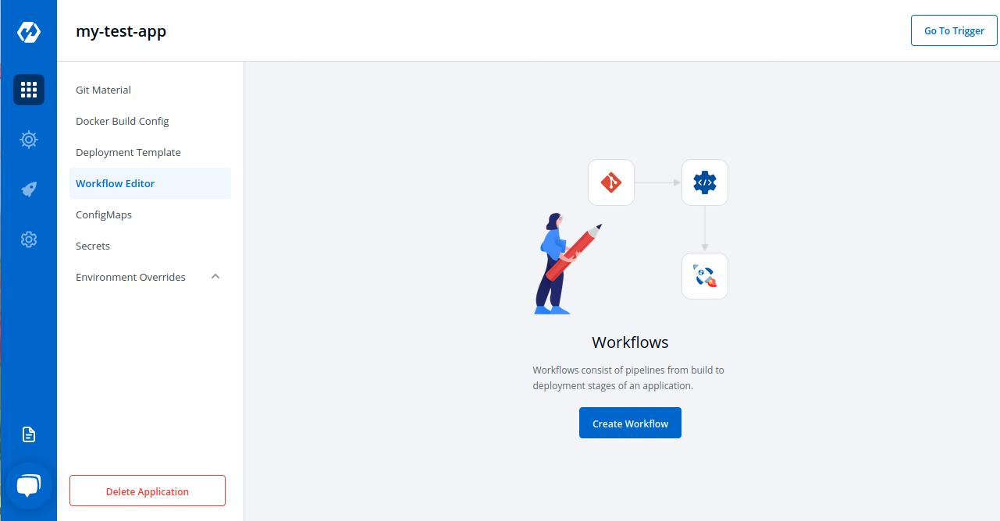
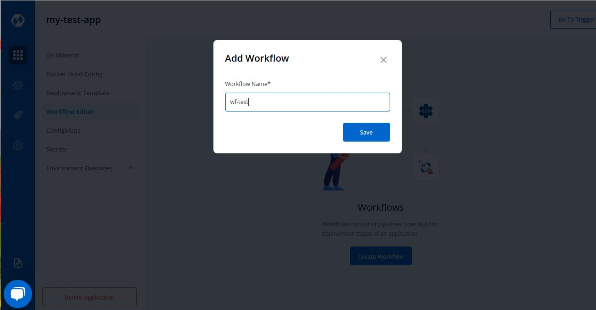

# Workflow Editor
Workflow is a logical sequenece of different stages used for continous integration and continous deployment of an application.

 

 

Click on Create Workflow to create a new workflow
 

Enter the  name of your workflow and then Click on Add Workflow to add a new workflow.

 

