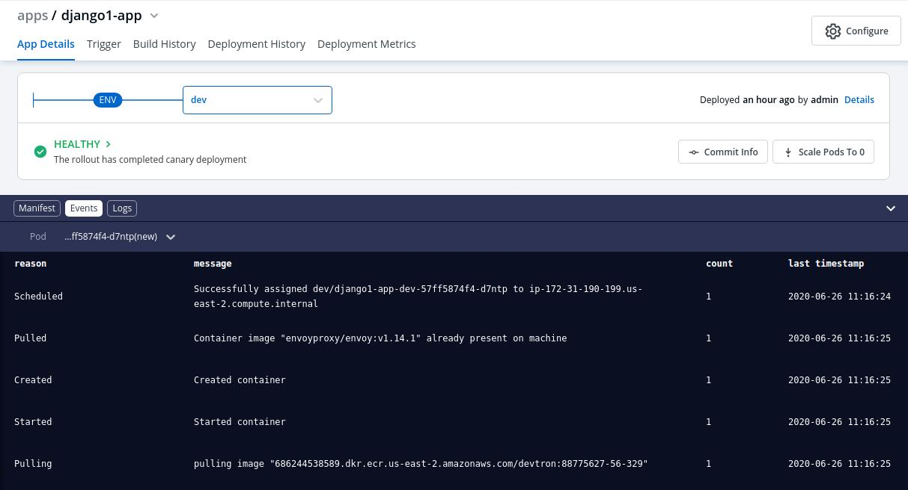
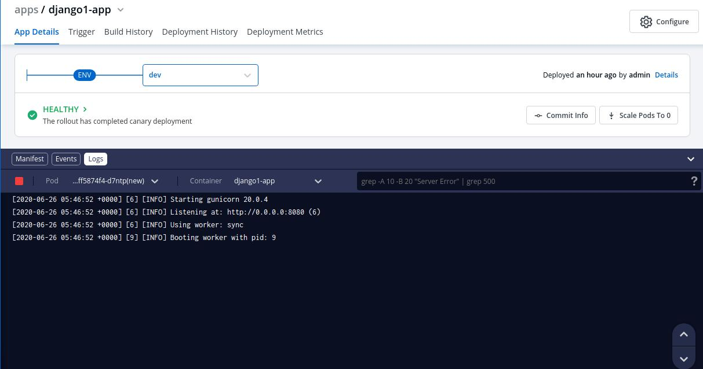
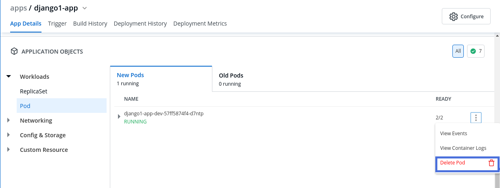
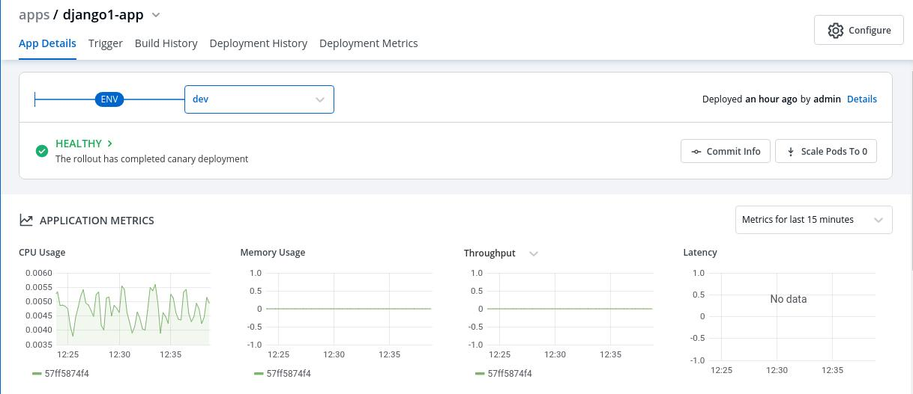

# Debugging Deployments And Monitoring
## Debugging Deployments

If the deployment your application is not successful, then debugging needs to be done to check the cause of the error.

This can be done through **App Details** section which you can access in the following way:- 

Applications->AppName->App Details

Over here, you can see the status of the app as Healthy. If there are some errors with deployment then the status would not be in a Healthy state.

### Events

&nbsp;&nbsp;

&nbsp;&nbsp;

Events of the application are accessible from the bottom left corner.

 

Events section displays you the events that took place during the deployment of an app. These events are available until 15 minutes of deployment of the application.

### Logs

&nbsp;&nbsp;

&nbsp;&nbsp;

Logs contain the logs of the Pods and Containers deployed which you can use for the process of debugging.

### Manifest

&nbsp;&nbsp;

&nbsp;&nbsp;

 

The Manifest shows the critical information such as Container-image, restartCount, state, phase, podIP, startTime etc. and status of the pods deployed.

### Deleting Pods

&nbsp;&nbsp;

&nbsp;&nbsp;

You might run into a situation where you need to delete Pods. You may need to bounce or restart a pod.

Deleting a Pod is not an irksome task, it can simply be deleted by Clicking on `Delete Pod`.

Suppose you want to setup a new environment, you can delete a pod and thereafter a new pod will be created automatically depending upon the replica count.

### Application Objects

You can view `Application Objects`, such as:

1.)***Workloads***(ReplicaSet, Status of Pods)
2.)***Networking***(Services, Endpoints, Ingress)
3.)***Config & Storage***(ConfigMap)
4.)***Custom Resource***(Rollout, ServiceMonitor)

in this section of `App Details`.

&nbsp;&nbsp;

&nbsp;&nbsp;

 
## Monitoring

&nbsp;&nbsp;

&nbsp;&nbsp;

You can monitor the application in the `App Details`section.

Metrics like CPU Usage, Memory Usage, Throughput and Latency can be viewed here.

Key | Description
----|----
`CPU Usage` | Percentage of CPU's cycles used by the app.
`Memory Usage` | Amount of memory used by app.
`Throughput` | Performance of the app.
`Latency` | Delay caused while transmitting the data.

  
