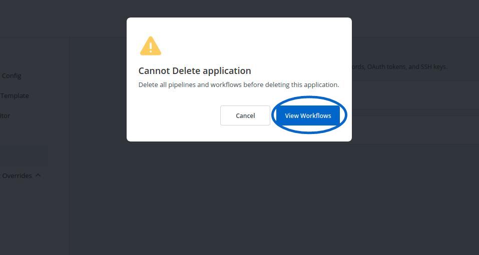
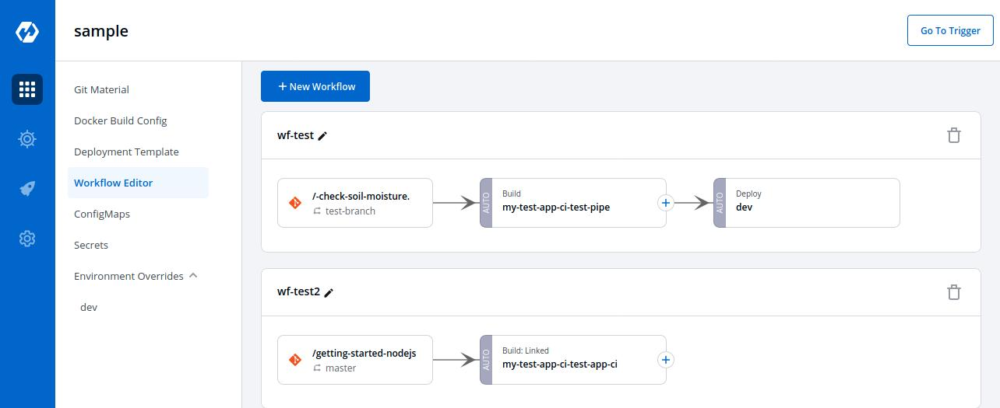
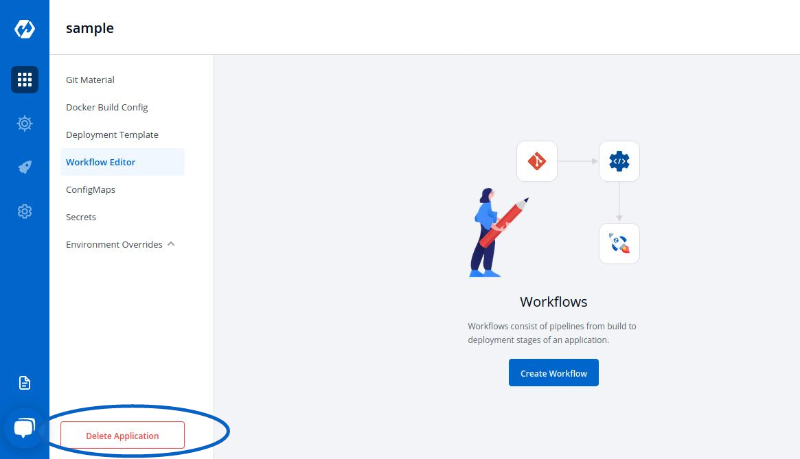

# Deleting Application

Delete the Application, when you are sure you no longer need it. 

Clicking on `Delete Application` will not delete your application if you have workflows in the application.

If your Application contains workflows in the Workflow Editor. So,when you Click on `Delete Application`, you will see the following prompt.

 

 

Click on `View Workflows` to view and delete your workflows in the application.

To delete the workflows in your application, you must first delete all the pipelines(CD Pipeline, CI Pipeline or Linked CI Pipeline or External CI Pipeline if there are any). 

 

 

After you have deleted all the pipelines in the workflow, you can delete that particular workflow.

Similarly, delete all the workflows in the application.

 

 

Now, Click on `Delete Application` to delete the application.
