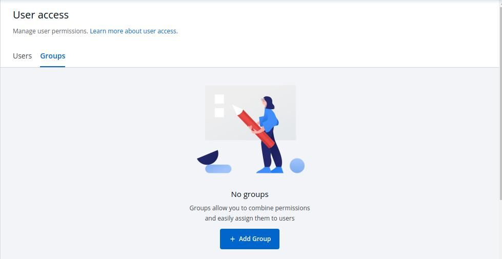

# User Access

Manage the `User` and `Group` access to Projects, Applications, Chart Groups, Environments, and Roles.

To control the `User` and `Group` access, 
Go to the left main panel -> Select `Global Configurations` -> Select `User Access` 

## **Users**

### **1. Add the new user**

Click on `Add New User`, to add one or multiple users.

&nbsp;&nbsp;

&nbsp;&nbsp;

### **2. Assign Super Admin Permissions**

After, you Click on `Add New User`, enter the *email addresses* of the users and Check the box of `Assign Super Admin Permissions`. 

If you click on the check box of `Assign Super Admin Permissions`, you give the assigned users complete access to all applications across the projects. Super Admin can add more Super Admins. 

&nbsp;&nbsp;

Click on `Save`, to assign super admin permissions to all the mentioned users.

### **3. Give limited access to users**

If you do not wish to give the users super admin permissions, then control their access in `Direct Permissions` section. Manage the project, Environment, Application and Role access given to the users.

&nbsp;&nbsp;

&nbsp;&nbsp;

You can add multiple rows, for `Direct Permissions`.

Once you have finished assigning the appropriate permissions for the listed users, Click on `Save`.

### **4. Manage Chart Group Permissions**

You can also manage the access of users to Chart Groups in your project.

You can either give the users permission to `Create` or `Edit`.

Click on the check box of `Create`, if you want users to create, view, edit or delete chart groups.

&nbsp;&nbsp;

&nbsp;&nbsp;

Click on the checkbox of `Edit`, if you want to allow or deny users to edit the chart groups. 

Select on `Deny` option from the drop-down menu, if you want to restrict the users to edit the chart groups.

&nbsp;&nbsp;

&nbsp;&nbsp;

Select `Specific Charts` option from the drop-down menu, and then select the chart groups for which you want to allow users to edit, from the other drop-down menu. 

&nbsp;&nbsp;

&nbsp;&nbsp;

Once you have configured all the required permissions for the users, Click on `Save`.

## **Groups**

### **1. Add new Group**

Click on `Add Group`, to create a new group. 

&nbsp;&nbsp;

&nbsp;&nbsp;

Enter the `Group Name` and `Description`.

&nbsp;&nbsp;

&nbsp;&nbsp;

### **2. Give limited access to groups**

Once you have given the group name and group description.

Then, control the access permissions of groups in `Direct Permissions`section. Manage the project, Environment, Application and Role access given to the groups.

&nbsp;&nbsp;

&nbsp;&nbsp;

You can add multiple rows, for `Direct Permissions` section.

Once you have finished assigning the appropriate permissions for the listed users, Click on `Save`. 

### **3. Manage Chart Group Permissions**

The chart group permissions for the group will be managed in the same as **Manage chart group permissions for users**. For reference, check [Manage chart group permissions for users](https://docs.devtron.ai/docs/reference/global-configurations/user-access/#4-manage-chart-group-permissions)

