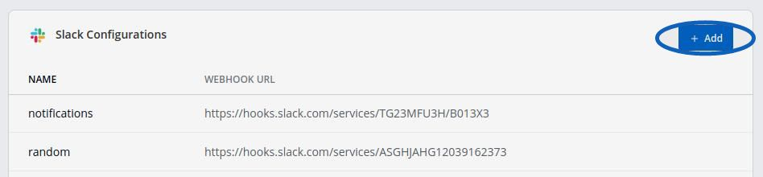
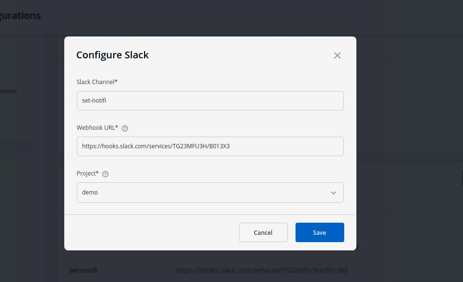

# Notification

This feature helps you manage the notifications for your build and deployment pipelines. You can recieve the notifications on Slack or via e-mail.

Click on Global Configurations-> Notification

< br />

## Manage Configuration

Click on **Configurations** to manage `SES Configurations` or `Slack Configurations`

 

 

## Manage SES Configurations

You can manage the SES configuration to recieve e-mails by entering the valid credentials. Make sure your e-mail is verified by SES. 

 

 

Click on `Add` and configure SES.

 

 

Key | Description
----|----
`Configuation Name` | Name of the SES Configuration 
`Access Key ID` | Valid AWS Access Key ID
`Secret Access Key` | Valid AWS Secret Access Key
`AWS Region` | Select the AWS Region from the drop-down menu 
`E-mail`     | Enter the SES verified e-mail id on which you wish to recieve e-mail notifications

 

## Manage Slack Configuration

You can manage the Slack configurations to recieve notifications on your preferred Slack channel.

 

 

Click on `Add` to add new Slack Channel.

 

 

Key | Description
----|----
`Slack Channel` | Name of the Slack channel on which you wish to recieve notifications.
`Webhook URL` | Enter the valid [Webhook URL link](https://slack.com/intl/en-gb/help/articles/115005265063-Incoming-webhooks-for-Slack) 
`Project` | Enter the project name to control user access

 

# Manage Notifications

Click on **Add New** to recieve new notification.

 

 

**Send To**

There are two options of recieving notifications

 

First, enter the name of your Slack Channel if you have already configured Slack Channel. 
If you have not yet configured the Slack Channel, Click on `Configure Slack Channel` 

 

 

**Select Pipelines**

This is to fetch pipelines of an app, project and environment. It is a 2 step process 

Choose a filter type(environment, project or application)

Then you will see a list of pipelines, 
You can select any number of pipelines.For each pipeline there are 3 types of events Trigger, Success and Failure

Click on the check boxes for the events, you wish to recieve notifications. 

Click on `Save` after you have configured Slack notification. 

 

Another option, is to enter the e-mail address/addresses of users to whom you  want to send e-mail notifications. Make sure e-mail id's are SES Verified.

If you have not yet configured SES, Click on `Configure SES`

 

 

Click on `Save` after you have configured the e-mail notification.

