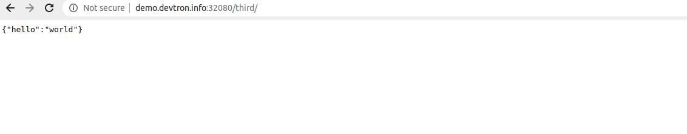

# Introduction
<br />

In this application, you will learn about how to create a Node Express Application that connects to mongoDb. 

Follow the below mentioned steps, to deploy the application on Devtron using mongoDb Helm Chart.

<br />

## Step 1: Deploy mongoDb Helm Chart

To deploy mongoDb Helm Chart, you can refer to our documentation on [Deploy mongoDb Helm Chart](https://docs.devtron.ai/docs/reference/deploy-chart/examples/deploying-mongodb-helm-chart/)

<br />

## Step 2: Fork the Git Repository

For this example, we are using the following [GitHub Repo](https://github.com/devtron-labs/DockerNodeMongo), you can clone this repository and make following changes.

### 1.) Dockerfile

This is the Dockerfile. This exposes our expressjs application to port number 8080

&nbsp;&nbsp;

```bash
FROM node:7
WORKDIR /app
COPY package.json /app
RUN npm install
COPY . /app
CMD node server.js
EXPOSE 8080
```

### 2.) db.js File

This file will be used to connect to our database. This will include the `service-name` of the mongoDb Helm Chart, that you have deployed in Step1.

The syntax is as follows:

<br />
`<service-name>:27017/<database-name>`

This maps our service name to mongoDb's port number 27017.

&nbsp;&nbsp;

```bash
module.exports = {
    DB: 'mondo-dev-mongodb-replicaset-client:27017/sale'
}
```


## Step 3: Create Application on Devtron

To learn how to create an application on Devtron, refer to our documentation on [Creating Application](https://docs.devtron.ai/docs/reference/creating-application/)

&nbsp;&nbsp;

### 1.) Git Material

In this example, we are using the url of the forked Git Repository.

### 2.) Docker configuration 

Give, the path of the Dockerfile.

### 3.) Configure Deployment Template

Enable `Ingress`, and give the path on which you want to host the application.

&nbsp;&nbsp;


&nbsp;&nbsp;

### 4.) Set up the CI/CD Pipelines

Set up the CI/CD pipelines. You can set them to trigger automatically or manually.

### 5.) Trigger Pipelines

Trigger the CI Pipeline, build should be **Successful**, then trigger the CD Pipeline, deployment pipeline will be initiated, after some time the status should be `Healthy`.
c

## Step 4: Final Step

Go and hit the application url.

The syntax is: `http://<hostname>/<path>/`

**path** will be the one that you had given in Step 3 while configuring the Deployment Template.

The output of our application should be as follows:

 

&nbsp;&nbsp;

You can see that we are getting the JSON response. We have successfully connected our express application to the mongoDb database.


