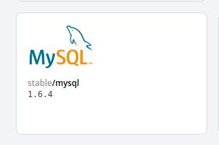
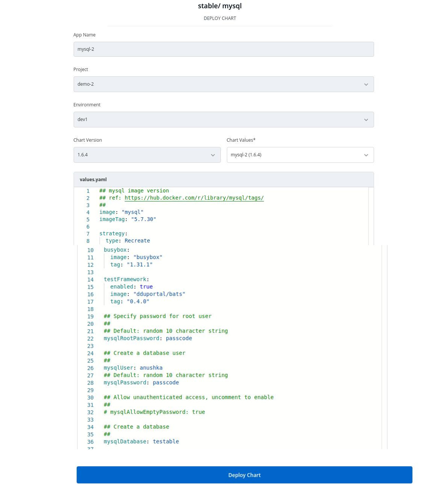
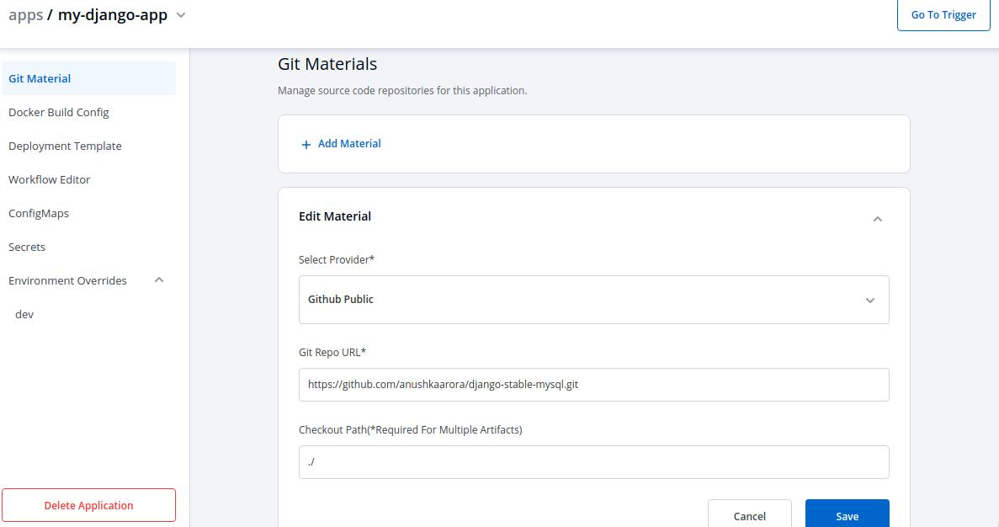
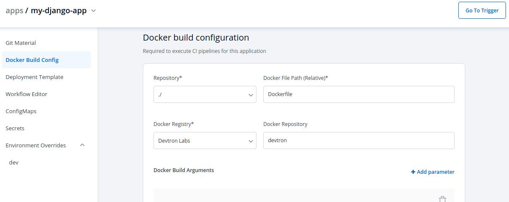
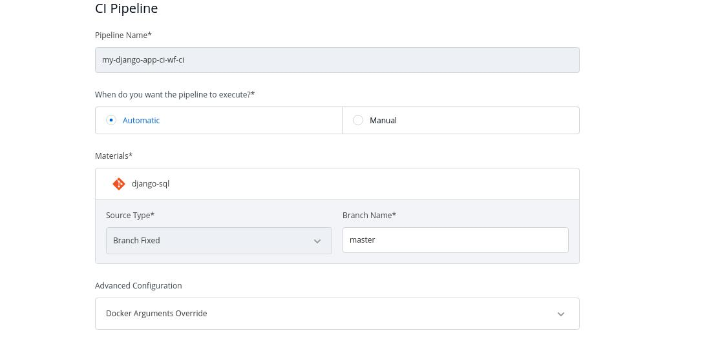
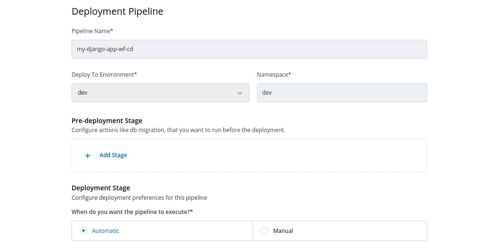

Django is a free, open-source web framework written in Python programming language. It allows for scalability, re-usability, and rapid development. Django can be connected to different databases like MySQL, PostgreSQL, etc.


<br />

Here we are using **stable/mysql Helm Chart** .

This chart bootstraps a single node MySQL deployment on a Kubernetes cluster using the Helm package manager.

<br />



<br />


## Set-up stable/mysql Helm Chart 


***Select the stable/mysql Helm Chart from the Chart Store*** 


<br />

***Click on `Deploy` to configure chart***


<br />

***Configure Chart***

The configuration values can be edited in the section given below Chart Version.

Key | Description
----|----
`App Name` | The name of the app
`Project` | Project of the app
`Environment` |Environment of the app to be deployed
`Chart Version` | Version of the chart to be used


<br />


Set the following parameters in the chart, to be later used to connect mysql with your Django Application:

<br />

Parameters     | Description
---------------|-------------
`mysqlRootPassword` | Password for the root user. Ignored if existing secret is provided
`mysqlDatabase` | Name of your mysql database
`mysqluser`     | Username of new user to create
`mysqlPassword` | Password for the new user. Ignored if existing secret is provided


<br />



<br />

Click on `Deploy` to deploy the Chart 

<br />


## Downloading and running the App

The code for Django sample app that connects to mysql is given in the repository on GitHub.

1.) You can use this repository as a Git Material to deploy app on Devtron:

`https://github.com/anushkaarora/django-stable-mysql.git`



<br />

2.) Configure the Database settings in the sample app

###  Configure Database Settings

* Open django-stable-mysql/settings.py for editing.

```python
 DATABASES = {
        'default': {
            'ENGINE': 'django.db.backends.mysql',
            'HOST': '[HOST-ADDRESS]',
            'USER': '[YOUR-USERNAME]',
            'PASSWORD': '[YOUR-PASSWORD]',
            'NAME': '[YOUR-DATABASE]',
        }
    }


```


3.) The repository contains the Dockerfile, specify the Relative path of Dockerfile and specify the name of the Docker Repository.


<br />




<br />

4.) Configure CI Pipeline in the Workflow Editor

<br />




<br />

Configure Deployment Pipeline in the Workflow Editor

<br />



<br />


5.) Go to `Trigger` and trigger the Pipeline 

<br/>


