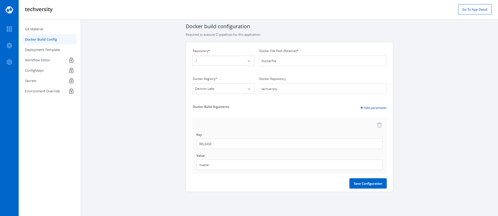

# Docker Build Configuration

Key | Description
-----|-----
`Repository` | Repository containing the docker file.
`Docker File Path` | Path of the docker file inside the repository.
`Docker Registry` | Registry where the docker images are to be pushed.
`Docker Repository` | Docker repository where docker images have to be pushed
`Docker Build Arguments` | Arguments for docker build can be added here.
