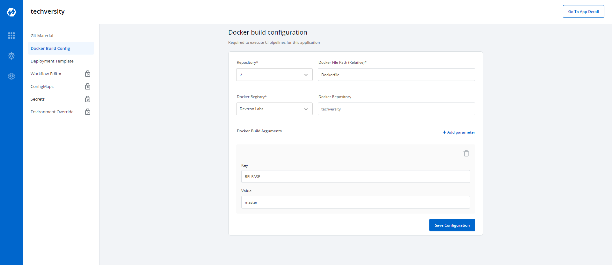

# Docker build Configuration 

Docker Build Configuration is required to execute CI Pipeline for your application.

 

Key  | Description
-----|-----
`Repository` | Select the path of Repository
`Docker File Path` | Give a Relative Path for your Dockerfile
`Docker registry` | Select the Docker Registry to be used
`Docker repository` | Name of the Docker Repository
`Key` | Key parameter for your Docker Build
`Value` | Value for a given key for your Docker build 

 

Click on `save Configuration` to save the Docker Build Configuration.