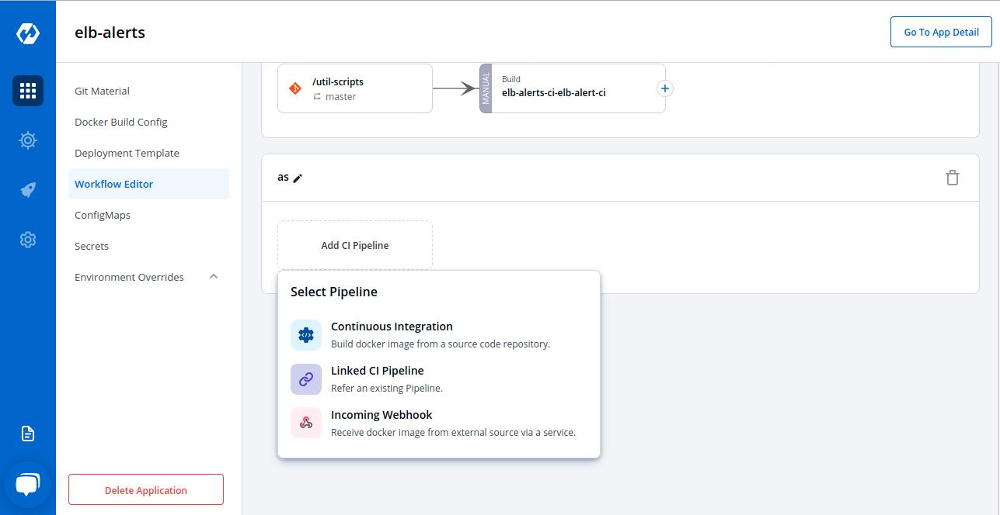
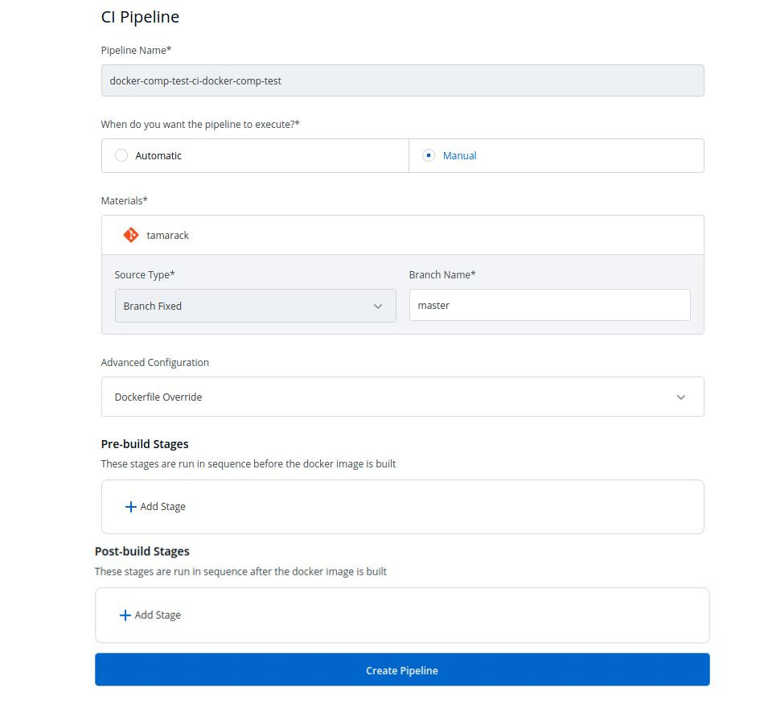
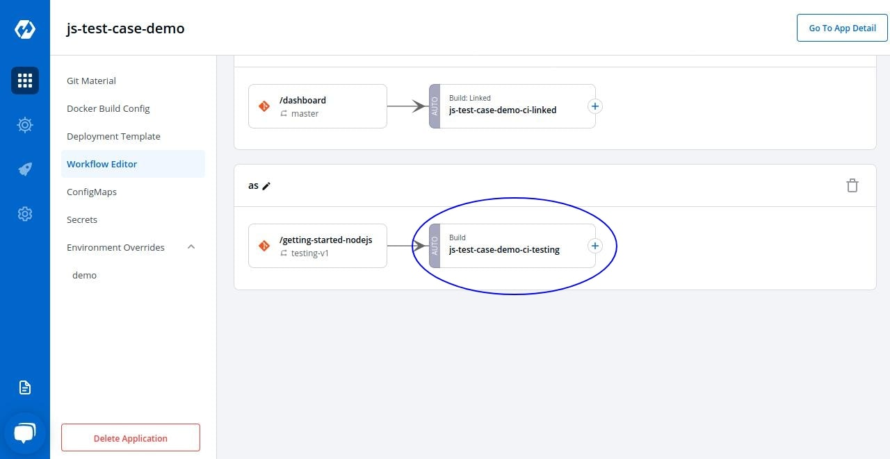
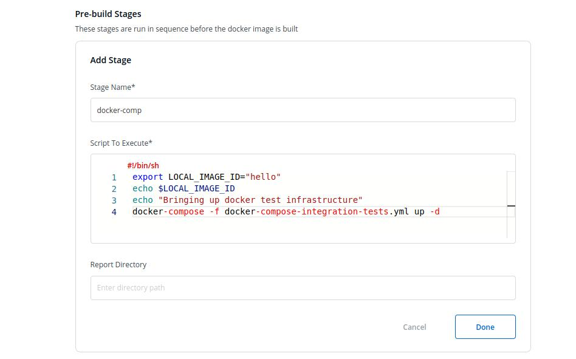
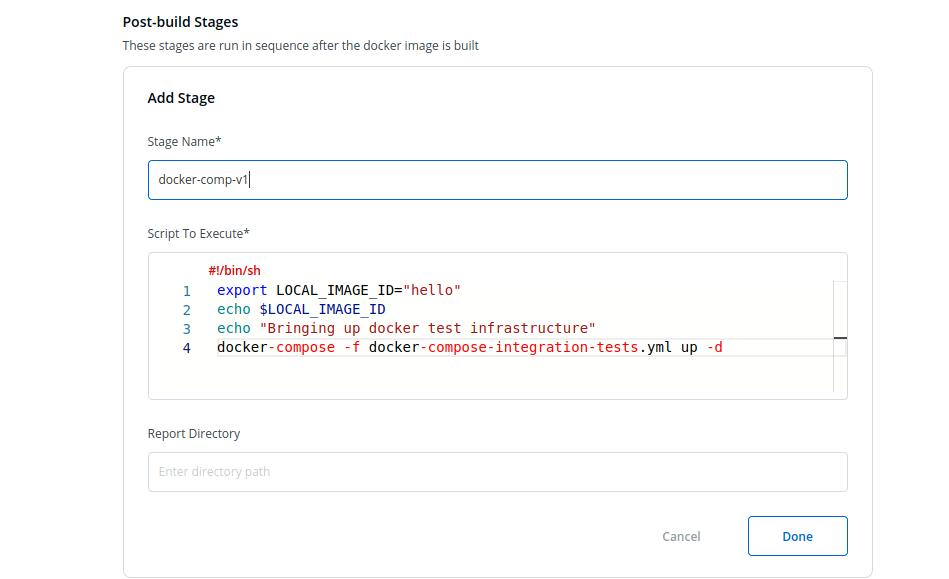
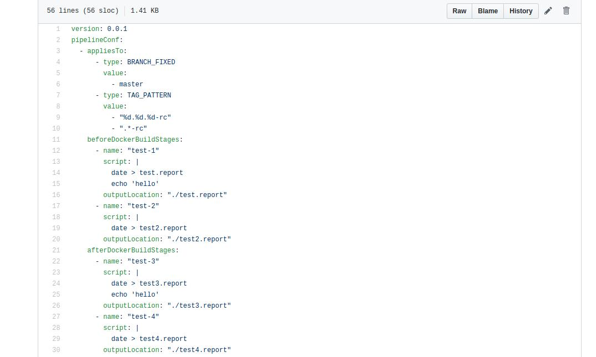
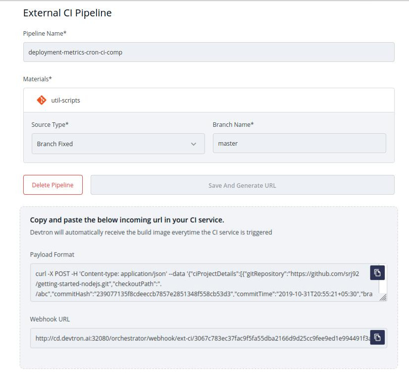
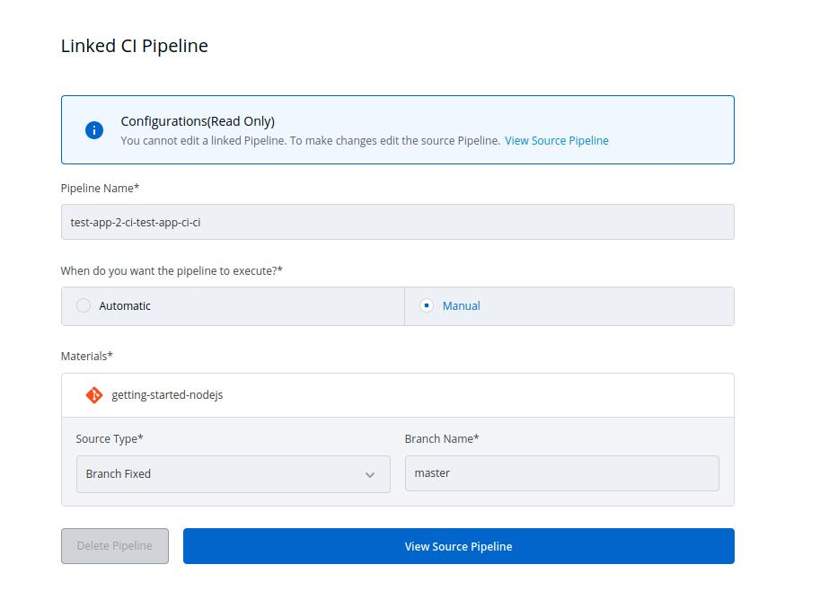

# CI Pipelines

##  Create CI Pipeline

 

&nbsp;&nbsp;

After creating the workflow,click on Add CI Pipeline to add a new CI Pipeline

&nbsp;&nbsp;

 

Click on Continous Integration to create a new CI Pipeline

&nbsp;&nbsp;

&nbsp;&nbsp;

Click on Create Pipeline to create the  pipeline

Key | Description
-----|-----
`Pipeline Name` | Name of the pipeline
`Source Type` | Select the source through which CI Pipeline will be triggered.
`Branch Name/Tag Regex` | Enter branch name/tag regex
`Pre-build Stages` | Scripts to be executed before building image
`Post-build Stages` |  Scripts to be executed after building image
`Advanced Configurations` | Arguments for CI

 

## Update CI Pipeline

You can update all the CI pipeline configurations after the CI pipeline is created except for the pipeline name, if you wish to change that you need to create another CI Pipeline

 
 To Update a CI Pipeline, go to the App Configurations and then click on Workflow editor

&nbsp;&nbsp;

 

Click on your CI Pipeline, to update the changes to your CI Pipeline.

&nbsp;&nbsp;

 

Click on `Update Pipeline` to update the changes you have made to your CI Pipeline

 

## Delete CI Pipeline 

You can delete the CI pipeline, if you don't require the CI pipeline. You can only delete CI Pipeline if you have no CD Pipeline created in your workflow or to delete CI Pipeline you first have to delete CD Pipeline if you have created it.

 

To Delete a CI Pipeline, go to the App Configurations and then click on Workflow editor

&nbsp;&nbsp;

 

Click on `Delete Pipeline` to delete the CD Pipeline

 

##  Pre/Post CI Stage

##### Pre-build Stages: 
These stages are run in sequence before the docker image is built

&nbsp;&nbsp;

&nbsp;&nbsp;

##### Post-build Stages
These stages are run in sequence after the docker image is built

&nbsp;&nbsp;

&nbsp;&nbsp;

## Automated Test suite integration in CI step using devtron-ci.yaml

User can run the Test case using the Devtron Dashboard `or` by including the Test cases in `devtron.ci.yaml` file in the source git repository. For reference, check: [https://github.com/kumarnishant/getting-started-nodejs/blob/master/devtron-ci.yaml](https://github.com/kumarnishant/getting-started-nodejs/blob/master/devtron-ci.yaml)

The test cases given in the script will run before the Test Cases given in the  `devtron.ci.yaml`

&nbsp;&nbsp;

&nbsp;&nbsp;

Field | Description
------|------------ 
`version`   | specify the version of yaml
`appliesTo` | applies the changes to a specified branch 
`type`      | branch type on which changes are to be applied, it can be BRANCH_FIXED or TAG_PATTERN 
`value`     | branch name on which changes are to be applied, it can take a value as name of branch ("master") or as a regular expression ("%d.%d.%d-rc")
`script`    | script which you want to execute, you can also execute the docker commands here
`beforeDockerBuildStages` | script to run before the docker build step
`afterDockerBuildStages`  | script to run after the docker build step
`outputLocation`          | location where you want to see the output of report of Test cases 

 

## External CI Pipeline

You can use Devtron for Deployments on Kubernetes while still using your own CI tool such as Jenkins. External CI feature can be used for such cases where 
the CI tool is hosted outside Devtron architecture.

&nbsp;&nbsp;

&nbsp;&nbsp;

You can send the 'Payload script' to your CI tool such as Jenkins and `Devtron` will receive the build image everytime the CI Service is triggered or
you can you use the `Webhook URL` which will build image everytime CI Service is triggered using `Devtron` Dashboard. 

 

 

Key | Description
-----|-----
`Pipeline Name` | Name of the pipeline
`Source Type`   | 'Branch Fixed' or 'Tag Regex'
`Branch Name` | Name of the branch

 

## Linked CI Pipeline

If one code is shared across multiple applications Linked CI Pipeline can be used, and only one image will be build for multiple applications because
if there is only one build, it is not advisable to create multiple CI Pipelines.

&nbsp;&nbsp;

 
