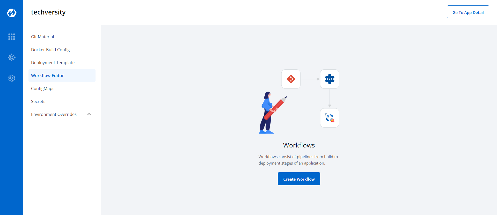
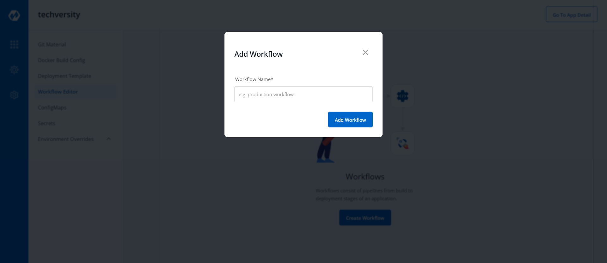
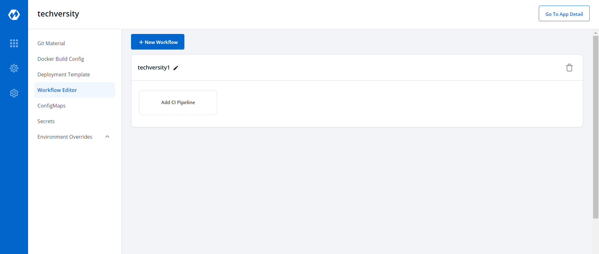
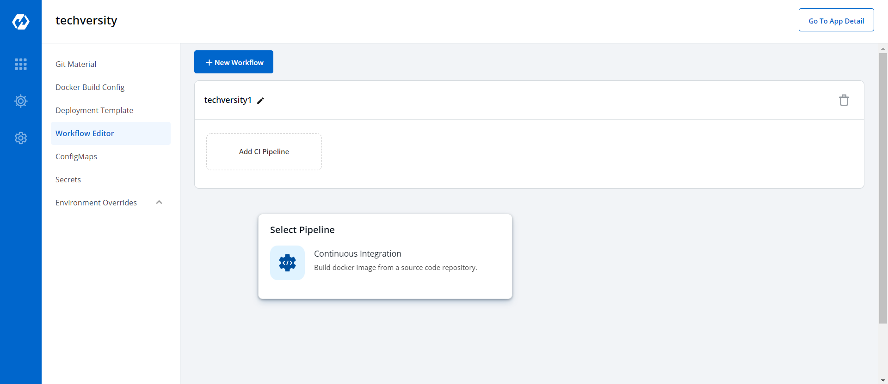
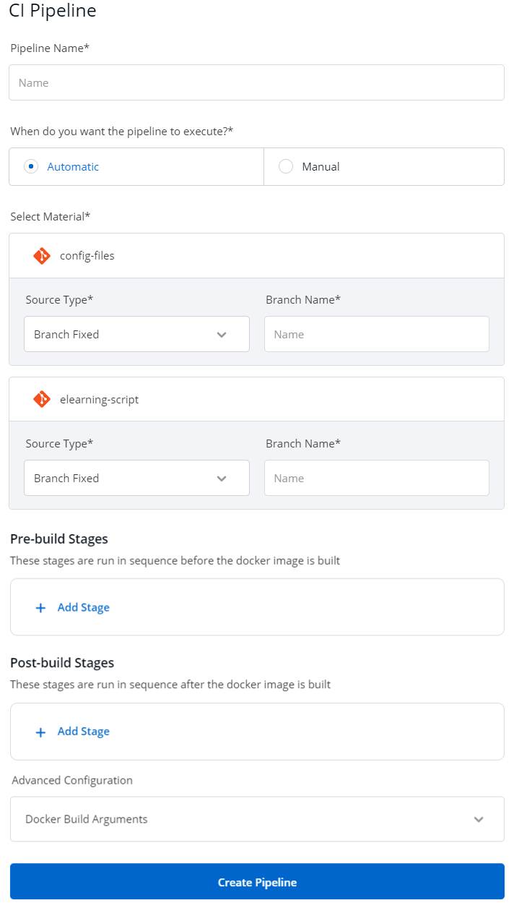
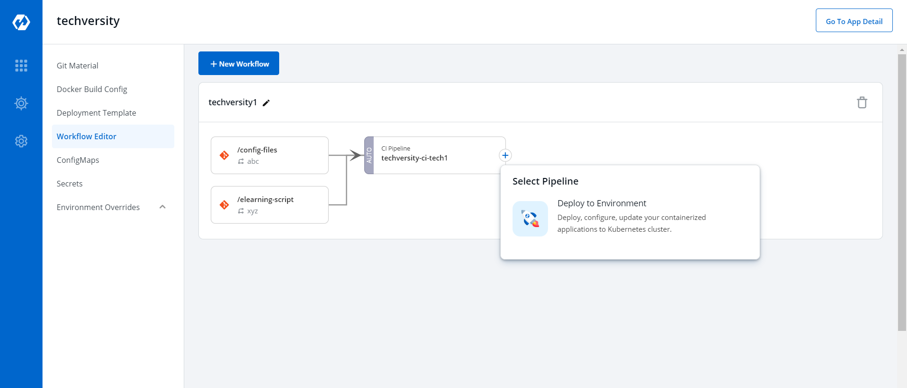
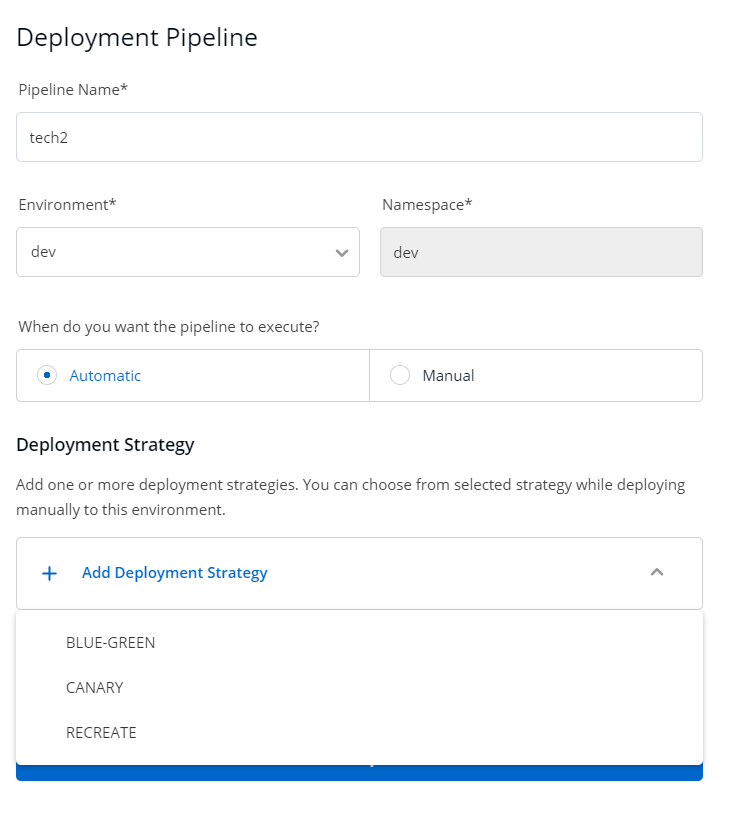
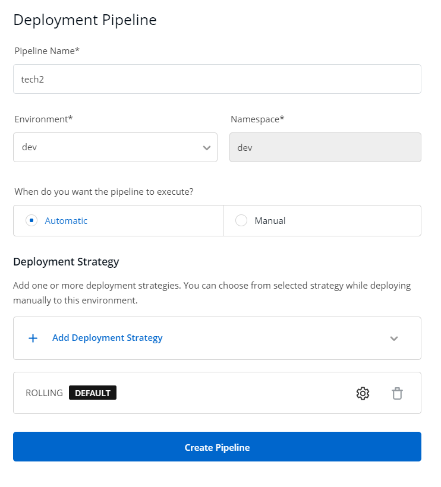
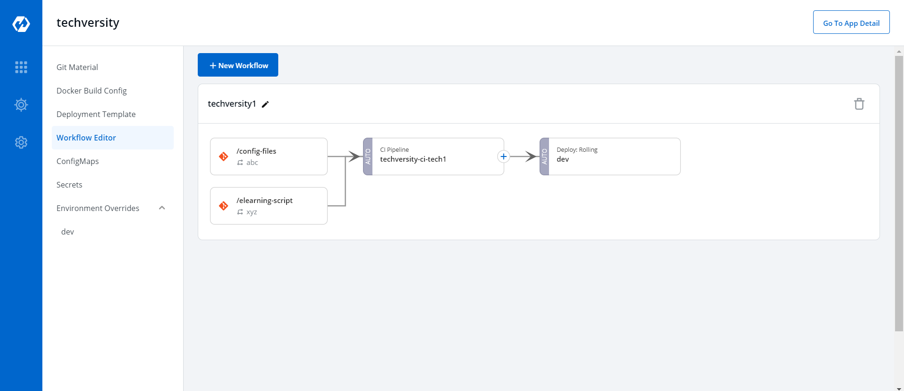

# Workflow Editor
**Workflow is a logical sequenece of different stages used for continous integration and continous deployment of an application**
 

 

**Click on Create Workflow to create a new workflow**
 

**Enter the desired name of the workflow and click on Add Workflow to add a new workflow.**
 

**After creating the workflow,click on Add CI Pipeline to add a new CI Pipeline**
 

**Select on Continous Integration to create a new CI Pipeline.**

 

Key | Description
-----|-----
`Pipeline Name` | Name of the pipeline
`Source Type` | Select the source through which CI Pipeline will be triggered.
`Branch Name/Tag Regex` | Enter branch name/tag regex
`Pre-build Stages` | Scripts to be executed before building image
`Post-build Stages` |  Scripts to be executed after building image

**Click on Create Pipeline to create the  pipeline**

 

**Click on "+" on CI Pipeline to attach a CD Pipeline**

 

**Select Deploy to Environment to create CD Pipeline**

 

Key | Description
----|----
`Pipeline Name` | Enter the name of the pipeline to be created
`Environment` | Select the environment
`Deployment Strategy` | Select the type of deployment strategy that  you want to enable by clicking "Add Deployment Strategy"

 

**Select Create Pipeline to create the CD Pipeline**

 

**The CD Pipeline is created**

 

